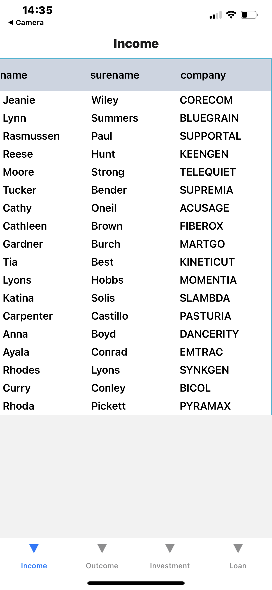

# List Page

# Example

# Application development plan:

## Done

- develop visually appealing UI/UX designs
- using data.js and integrate it to page

## Application includes:

<ul>
<li>List Page from data 
</ul>

## Technology stack:

React, React Native, Expo, React-native-table-component, TailwindCSS, Nativewind  

## Installation

1. Clone this repo
2. `npm install`
3. `npm run start`
4. You can Scan the QR code above with Expo Go (Android) or the Camera app (iOS)
5. Or web on http://localhost:19000
     
